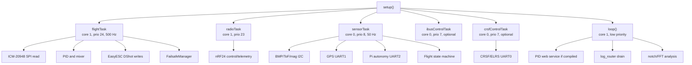

# Current FCU Architecture And Configurator Migration Plan

Date inspected: 2026-06-20

This document records the current firmware architecture before replacing the PID web UI with a Windows-only FCU Configurator. It is intentionally descriptive. No flight behavior, motor behavior, failsafe logic, sensor logic, or build flags were changed as part of this inspection.

## Inspection Scope

The inspection covered the repository root, `platformio.ini`, `src/main.cpp`, PID webserver sources, NVS helpers, communication modules, sensor modules, motor modules, logging, WiFi/OTA support, bench/test firmware, and support headers. Large external/generated directories such as `.venv`, `.pio`, and `betaflight` were not treated as FCU source.

## Build Environments

| Environment | Role | Relevant observations |
| --- | --- | --- |
| `esp32-s3-mini` | Main ESP32-S3 Mini FCU image | USB CDC is enabled. CRSF/iBUS, GPS, ToF, BMP, Pi UART, dynamic notch, autonomy scaffolding, telemetry radio, and gimbal flags are present. Wireless features are off by default. |
| `esp32-s3-mini-pidweb` | Bench/tuning web UI image | Extends the main image, excludes the stub PID webserver, includes `pid_webserver_enabled.cpp`, and enables `ENABLE_PID_WEBSERVER=1`. This is a bench/tuning image, not a flight-safe release target. |
| `esp32-s3-mini-wireless` | Wireless logging/OTA image | Enables WiFi logging/OTA and CH9 runtime toggle. Wireless features stay off until enabled while disarmed. |
| `fcu_motor_fft_test` | Motor/FFT bench image | Separate motor sweep and notch validation target. Uses serial commands and stricter bench procedures. |
| `fcu_bench_test`, `ekf_sim`, `native_ekf_sim` | Bench/simulation images | Used for isolated validation and algorithm testing. |

Important risk: the main build currently defines `FCU_DISABLE_FAILSAFES=1` in `platformio.ini` even though nearby comments describe flight re-enablement. That is a release-blocking configuration issue for any future "flight" label, but this stage does not change it.

## Firmware Runtime Layout

The firmware is already split into FreeRTOS tasks with clear ownership boundaries.

Key timing and ownership:

- `flightTask` owns IMU sampling, attitude update, failsafe application, control loop execution, and all normal DShot writes.
- `sensorTask` owns slow sensors, companion/Pi UART polling, GPS parsing, battery polling, and flight-state observation.
- `radioTask` owns nRF24 SPI traffic and telemetry radio service.
- `crsfControlTask` and `ibusControlTask` feed the same control packet path as the legacy radio path.
- `loop()` services low-priority work: PID webserver, WiFi/log draining, command-line bench features, FFT analysis, and periodic summaries.

This separation is good for a configurator migration. The first firmware-side configurator endpoint should run at low priority and post bounded commands into existing callback surfaces instead of touching the flight loop directly.

## Communication Paths

| Path | Current state | Notes for configurator |
| --- | --- | --- |
| USB CDC serial | Enabled by `ARDUINO_USB_MODE=1` and `ARDUINO_USB_CDC_ON_BOOT=1`; `Serial.begin(115200)` and `Serial.setTxTimeoutMs(0)` are used. | Today it carries logs and bench CLI text. A binary protocol must avoid log pollution through an explicit endpoint mode or release log gating. |
| PID web HTTP/WebSocket | Only compiled in `esp32-s3-mini-pidweb`. Mutating routes require `X-Auth-Token`. | This is the functional surface to preserve and gradually replace. |
| nRF24 control/telemetry | Legacy 32-byte packed control/telemetry packets in `include/control_protocol.h`. | Not suitable as the Windows configurator protocol. Keep separate. |
| CRSF/ELRS | UART0 RX/TX on GPIO36/GPIO37 at 420000 baud when enabled. FC telemetry can send battery, attitude, GPS, and mode to handset. | Should remain a flight/control link, not the desktop configurator transport. |
| iBUS | Optional receiver path. | Feeds the existing control packet path. |
| Pi autonomy UART | HardwareSerial(2), default GPIO17/GPIO18 at 115200. ASCII heartbeat/command plus `$AI,seq,decision,class_id,confidence*XX`. | Not a configurator transport. Manual RC override remains absolute. |
| ESC telemetry | Optional BDShot or KISS UART telemetry; UART path can reuse UART2/GPIO15 depending flags. | Future configurator can surface telemetry only after ownership conflicts are explicit. |
| WiFi logging/OTA | Compiled out by default; wireless envs keep it off until disarmed toggle. | Do not rely on WiFi for the Windows-only configurator. |
| BLE | No current BLE service, BLE pairing mode, GPIO0 triple-click handler, or BLE status LED behavior was found. | Future BLE support needs a new staged design and hardware verification. |

## PID Web UI Surface

The existing PID web UI is broad and useful. It should be treated as the behavior reference for the Windows configurator.

Current endpoint groups include:

- PID read/apply/save/revert/reset.
- Mixer pitch-front bias read/apply/save.
- Failsafe bypass read/apply/save.
- Dashboard state, health, tune, calibration, and telemetry snapshots.
- IMU, level, trim, accelerometer, and magnetometer calibration actions.
- Dynamic notch status, FFT capture, apply, enable, save, and reload actions.
- Servo/gimbal control actions.
- Diagnostic capture start/stop/clear/CSV download.
- Single-motor pulse test endpoint.

The webserver uses callbacks registered from `main.cpp`. That callback table is the safest migration seam: the desktop configurator protocol can call the same callback-level operations while keeping all existing disarmed checks and NVS write paths.

## Sensor Inventory

| Subsystem | Bus and pins | Code owner | Current status model |
| --- | --- | --- | --- |
| ICM-20948 IMU | SPI, MOSI GPIO11, SCK GPIO12, MISO GPIO13, CS GPIO14 | `imu_module.h`, `src/main.cpp` | Flight loop reads at 500 Hz. Accel/gyro validity and mag validity are separate. |
| Onboard AK09916 mag | Inside ICM-20948 | `imu_module.h`, `src/main.cpp` | Optional yaw fusion path. Magnetometer health is gated by field/validity checks. |
| BMP280/BME280 barometer | I2C SDA GPIO9, SCL GPIO10, address 0x76 or 0x77 | `baro_module.h`, `src/main.cpp` | Sensor task polls and reports age/failure counts. |
| VL53L1X ToF | I2C SDA GPIO9, SCL GPIO10, address 0x29 | `tof_module.h`, `src/main.cpp` | Sensor task polls ranging state, mm distance, and sample age. |
| Optional MMC5603 external mag | I2C SDA GPIO9, SCL GPIO10, address 0x30 | `external_mag.h`, `src/main.cpp` | Compiled off by default; runtime enable/prefer flags are NVS-backed when compiled in. |
| GPS | UART1, TX GPIO33, RX GPIO34, default 9600 baud | `gps_module.h`, `src/main.cpp` | Parses NMEA GGA/RMC with checksum, fix state, satellites, HDOP, origin debounce. |
| Battery voltage | ADC GPIO2 | `battery_module.h`, `src/main.cpp` | Oversampled ADC, gain-backed voltage, percent estimate, low-battery flag. |
| CRSF/ELRS receiver | UART0 RX GPIO36, TX GPIO37 | `crsf_control.h`, `src/main.cpp` | RC link, failsafe flag, LQ/RSSI, and handset telemetry. |
| nRF24 radios | SPI MOSI GPIO4, MISO GPIO5, SCK GPIO6, control CSN GPIO7/CE GPIO15/IRQ GPIO16, telemetry CSN GPIO8/CE GPIO21/IRQ GPIO38 | `nrf_telemetry.h`, `src/main.cpp` | Legacy control plus telemetry/diversity counters. |
| Companion/Pi autonomy | UART2 TX GPIO17, RX GPIO18 | `autonomy_uart.h`, `src/main.cpp` | Heartbeat, command, and `$AI` decision stream with confidence and timeout gating. |
| DShot motors | GPIO39, GPIO40, GPIO41, GPIO42 | `motor_module.h`, `src/main.cpp` | Flight loop owns writes. Per-motor accepted raw values and write mask are tracked. |

Configurator sensor colors should be based on compiled/present/healthy/fresh state, not on initialization alone. The existing dashboard already distinguishes missing, stale, not compiled, and healthy states.

## GPIO0 And Status LEDs

No firmware use of GPIO0 was found. Repository references to BOOT are limited to ESP32-S3 flashing instructions, USB CDC boot flags, and internal "safe boot" state names. GPIO0 may still be electrically special because it is an ESP32 strapping/BOOT pin, so using it for runtime pairing or triple-click behavior requires board-level verification before implementation.

Current LED-related facts:

- Base build flags set `FCU_PIN_NRF_RX_OK_LED=48` and `FCU_PIN_NRF_TX_OK_LED=47`.
- `src/main.cpp` defaults `FCU_PIN_NAV_OK_LED=47`.
- `initRadioStatusLeds()` skips an nRF LED if it equals the nav LED pin.
- `LedBlinker gNavLed` owns the navigation/system blink pattern.
- No BLE LED state machine exists today.

Before adding a two-LED configurator/BLE scheme, resolve whether GPIO47 is navigation, nRF TX status, or shared by design in the target hardware.

## Motor Command Path

Normal command path:

1. RC input arrives through CRSF, iBUS, or legacy nRF.
2. `processControlPacket()` updates the shared control packet and autonomy enable state.
3. `flightTask` runs every 2 ms.
4. `applyFailsafeIfNeeded()` evaluates safety state.
5. `updateControlLoop()` checks arming gates, throttle, failsafe state, FSM state, RPM filter readiness, passthrough state, and safe-boot state.
6. PID correction and mixer outputs are computed.
7. `applyMotorOutputs()` writes DShot commands through EasyESC and stores accepted raw values/write mask.

Current X quad motor mapping:

- M1 GPIO39: front-right, CW.
- M2 GPIO40: rear-right, CCW.
- M3 GPIO41: front-left, CCW.
- M4 GPIO42: rear-left, CW.

PID web motor test path:

1. `/api/motor/spin?m=N` calls `requestMotorSpin(N)`.
2. The request is accepted only for motor 1 to 4 and only when startup settle is clear, throttle is zero, failsafe is clear, motor outputs are idle, FSM is idle, and gyro calibration is not running.
3. `flightTask` calls `servicePidWebMotorSpin()`.
4. The selected motor receives `PIDWEB_MOTOR_TEST_RAW=300` for `PIDWEB_MOTOR_TEST_MS=300`.
5. During the pulse, the normal failsafe/control-loop update is skipped for that tick.
6. Completion or abort calls `forceMotorStop()`.

Likely reasons a PID-web motor-test click may fail to visibly spin without indicating a broken ESC path:

- DShot raw 300 for 300 ms may be below the visible spin threshold for some ESC/motor combinations.
- Startup settle can reject the test.
- Throttle, active motor outputs, failsafe latch, FSM state, or gyro calibration can reject the test.
- The PID-web UI exposes only a one-shot pulse, not a held deadman test with live feedback.
- HTTP/WebSocket disconnect is not a motor-test deadman surface.

USB configurator motor test path:

1. The Windows app sends `MOTOR_TEST_ARM`.
2. Firmware accepts only when ESCs are ready, startup settle is clear, throttle is zero, failsafe is clear, the observer FSM is idle, calibration is idle, the PID-web one-shot test is idle, and motor outputs are idle.
3. While the operator holds a motor button, the app repeatedly sends `MOTOR_TEST_SET` with motor mask, raw DShot command, and a short timeout.
4. `flightTask` calls `serviceConfiguratorMotorTest()` before the normal one-shot and control-loop paths.
5. Release, explicit stop, output timeout, session timeout, or any safety-state change clears the session and calls `forceMotorStop()`.

## Configuration And NVS

`include/fcu_nvs.h` owns most persisted tuning/configuration records. The PID web UI already distinguishes runtime apply from save-to-NVS operations:

- Runtime apply updates live atomics or callback-owned state.
- Save endpoints commit values to NVS.
- Revert/reload endpoints restore NVS values into runtime state.
- Reset endpoints restore compile-time defaults.

The configurator should keep the same UX distinction: "Apply" means RAM/live state, "Save" means NVS persistence, and read-back verification should be visible.

## Performance And Release Risks

Measured loop jitter and CPU time were not captured during this inspection. The risks below are based on code paths and build flags, not live timing measurements.

- USB CDC currently shares the same stream as logs and bench commands. Binary configurator frames need a clean endpoint mode or release log gating.
- Heavy logs exist across flight, link, motor, autonomy, FSM, tuning, and health surfaces. `log_router` is non-blocking, but direct `Serial.print/printf` calls still exist in setup and some error paths.
- PID web is low priority and bench-only, but it still brings WiFi/HTTP/WebSocket memory pressure into that image.
- NVS writes are disarmed-gated through existing callbacks and should stay out of the flight loop.
- I2C sensors share a 100 kHz bus and are polled from `sensorTask`; future configurator polling should avoid increasing sensor bus pressure.
- Dynamic notch and FFT analysis are already staged with low-priority analysis, but future desktop streaming must avoid high-rate blocking serial writes.
- The current base build's failsafe-disable flag conflicts with release-oriented comments and must be audited before any "flight release" claim.

## Safe Migration Plan

Stage 1, current state:

- Document the current architecture, hardware surfaces, data paths, motor path, and migration risks.
- Do not modify embedded behavior.

Stage 2, protocol foundation:

- Define a binary frame format for the Windows configurator.
- Implement and test a desktop-side encoder/parser with sequence numbers, ACK/NACK payloads, CRC validation, resynchronization, max-length enforcement, and partial-frame handling.
- Keep the protocol implementation independent from normal flight builds until transport ownership and log separation are explicit.

Stage 3, firmware endpoint behind a bench-only flag:

- Add a disabled-by-default USB configurator endpoint.
- Compile it first only in a bench/configurator environment, not the flight image.
- Route commands through the existing PID web callback table or equivalent functions.
- Refuse motor/configuration mutations unless disarmed and safe.
- Keep all parsing bounded per loop tick and never block the flight task.

Current implementation status: `esp32-s3-mini-configurator` now enables `ENABLE_USB_CONFIG=1` and `FCU_ENABLE_USB_SERIAL_LOGGING=0`. The endpoint runs from `loop()`, parses bounded binary frames, and supports handshake, capabilities, state, sensor status, PID config read/apply/save/revert, calibration begin, and disarmed deadman motor testing. It does not yet implement BLE, firmware update, sensor rescan, or hardware-measured stop-latency reporting.

Stage 4, Windows desktop shell:

- Build the Windows-only app using Vue inside NW.js/Node.
- Add serial discovery, connect/disconnect, FCU identity, firmware capability readout, and a sensor detect wizard.
- Use Three.js for the 3D model, but keep serial/protocol code isolated from presentation components.

Current implementation status: the desktop shell exists under `configurator/` with Vue, Three.js, NW.js metadata, mock FCU, USB serial transport, BLE transport stub that fails closed, dashboard, sensors, PID tuning, held deadman motor test UI, scripts, tests, and a portable ZIP build. The installer/signing stage is still pending.

Stage 5, safe calibration and motor testing:

- Port calibration flows from PID web.
- Hardware-measure the motor test workflow stop latency for release, timeout, disconnect, and unsafe-state transitions.

Stage 6, optional BLE pairing:

- Implement only after GPIO0 and LED ownership are verified on hardware.
- Keep pairing mode time-limited and disarmed-only.
- Define a clear state machine for disconnected, USB connected, BLE pairing, BLE connected, fault, and normal status.

Stage 7, PID web retirement:

- Keep PID web available until desktop parity exists for tuning, calibration, dashboard, capture, notch, NVS save/revert, and motor-test workflows.
- Remove or demote the web UI only after the Windows configurator has equivalent safety gates and test coverage.

## Open Hardware Facts

These facts cannot be proven from the repository alone:

- Whether GPIO0 is physically exposed, debounced, and safe for runtime button use on the assembled FCU.
- Whether GPIO47 and GPIO48 are the intended two status LEDs, or whether GPIO47 is intentionally shared between nav and nRF TX status.
- Whether the target Windows deployment should use USB only at first or include BLE in the first production milestone.
- Actual worst-case loop timing while streaming configurator telemetry over USB.
